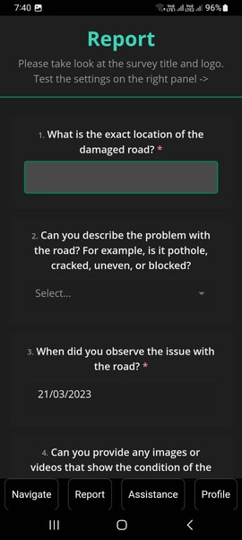

#Kavach

Citizen Portal/ App for Mitigating Road Safety Issues!

Objectives:-
 - A person can **raise an issue or report any violation** through the app.
 - In case of an **accident**, the app shall **send message to police, ambulance, and nearby hospital.**
 - In case of any **violations, police and other stakeholders may take an action** on to the issue raised by the app.
 - The solution should **help to prevent accidents** as well.

Features of Kavach:-

For User:
 - Allows users to **report accidents easily and without hassle.**
 - Offers a **bounty program** for reporting voilations of law.
 - Assistance to users by **identifying nearby facilities such as hospitals, police stations, and tow trucks.**
 - Integrated with **emergency services** for quick and efficient response **in case of an accident**.
 - **Revolutionize the way we approach road safety** and make a significant impact on **saving lives.**

For Admin:

Using Rollbased Access Control (RABC) Mechanism
 ```mermaid
graph TD;
    RABC-->ADMIN;
    RABC-->POLICE;
    RABC-->HOSPITAL;
    ADMIN-->NAGAR_NIGAM;
    ADMIN-->FIRE_BRIGADE;
    ADMIN-->TOW_TRUCK;
```  

Usage of Kavach:-

For User:

As soon as you open the application the following screen will show up and if there is an emergency immediately report to police and hospital and you can even navigate your near by hospital and police station.

  
 
The below navigation screen will show up and indicate us about potholes in the area

 

If the user want report an issue about Bad Road Condition & Violation of Law the Report option is available and the user need to fill survey form for the same.The appropriate Bounty Points will be provided after properly examine the report by higher authority.

   
 
In case of user want assitance about nearby Mechanics,Petrol Pump and Chauffer the Assitance option is given

   
 
The profile option contains the details of the application user and bounty points awarded to them for their contribution.


 

For Admin:

 
